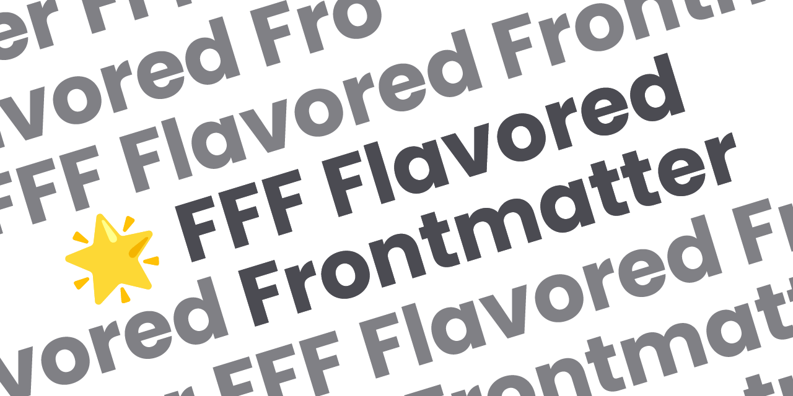

<div align="center">
  <picture>
    <source media="(prefers-color-scheme: dark)" srcset="./docs/public/fff-dark.png">
    
  </picture>
  <h6>The Flexible & Functional Frontmatter Solution.</h6>
</div>

---

<div align="center">

**[<kbd> <br> Introduction <br> </kbd>](https://fff.js.org/intro/what-is-fff.html)** 
**[<kbd> <br> Concepts <br> </kbd>](https://fff.js.org/concepts/object-media.html)** 
**[<kbd> <br> Version <br> </kbd>](https://fff.js.org/version/changelog.html)**

</div>

---

## 📦️ Packages

### [fff-flavored-frontmatter](/packages/fff-flavored-frontmatter/)

[](https://npmjs.com/package/fff-flavored-frontmatter)
[](https://www.jsdocs.io/package/fff-flavored-frontmatter)


[](https://deno.land/x/fff)

Type definition of the FFF Flavored Frontmatter.

```ts
import type { FFFFlavoredFrontmatter } from 'fff-flavored-frontmatter'
```

---

### [remark-fff](/packages/remark-fff/)

[](https://npmjs.com/package/remark-fff)
[](https://www.jsdocs.io/package/remark-fff)


Remark plugin for auto-conversion other frontmatter variable formats to FFF Flavored Frontmatter.

```ts
import remarkFFF from 'remark-fff'

export default defineConfig({
  remarkPlugins: [[remarkFFF, { presets: ['hugo'], target: 'astro' }]],
})
```

---

### [markdown-it-fff](/packages/markdown-it-fff/)

[](https://npmjs.com/package/markdown-it-fff)
[](https://www.jsdocs.io/package/markdown-it-fff)


markdown-it plugin for auto-conversion other frontmatter variable formats to FFF Flavored Frontmatter.

```ts
import MarkdownIt from 'markdown-it'
import { frontmatterPlugin } from '@mdit-vue/plugin-frontmatter'
import { fffPlugin } from 'markdown-it-fff'

const md = MarkdownIt().use(frontmatterPlugin).use(fffPlugin)
```

---

### [indiekit-preset-fff](/packages/indiekit-preset-fff/)

[](https://npmjs.com/package/indiekit-preset-fff)


FFF Flavored Frontmatter publication preset for Indiekit.

```json
{
  "plugins": ["indiekit-preset-fff"],
  "indiekit-preset-fff": {
    "format": "yaml",
    "types": "urara"
  }
}
```

---

### [create-fff](/packages/create-fff/)

[](https://npmjs.com/package/create-fff)


```bash
pnpm create fff netlify-cms
```

## 📄 License

> [glowing_star.svg](docs/public/glowing_star.svg) from the [adobe-fonts/noto-emoji-svg](https://github.com/adobe-fonts/noto-emoji-svg) distributed under the [Apache License, Version 2.0](https://github.com/adobe-fonts/noto-emoji-svg/blob/main/LICENSE).

This work is free, it comes without any warranty. You can redistribute it and/or modify it under the
terms of the Do What The Fuck You Want To Public License, Version 2,
as published by Sam Hocevar. See the [COPYING](COPYING) file for more details.
